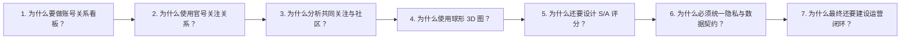

# AI Orbit：连续追问七个为什么的项目思维链路

> 用途：理解项目原型、梳理产品建设逻辑、准备 AI 产品运营 / AI 产品经理面试。  
> 说明：这是一条连续因果链，不是七个互不相关的功能介绍。

## 一句话概括

```text
账号信息太分散
→ 用官号关注关系形成行为信号
→ 用共同关注发现关系共识
→ 用社区和 3D 表达复杂网络
→ 用可解释评分转成运营优先级
→ 用隐私与数据契约保证可信
→ 用名单、状态和结果回写形成运营闭环
```



---

## 为什么一：为什么要做这个账号关系看板？

### 继续追问的起点

运营人员明明可以直接打开 X，为什么还要重新建设一个网页？

### 核心答案

因为真正的问题不是“找不到账号”，而是：

- 多个官号的关注列表彼此分散；
- 同一个创作者可能被多个品牌同时关注；
- 人工逐个打开官号、翻列表、复制账号，效率很低；
- 表格能保存结果，但不能直接表现账号之间的关系；
- 运营很难回答“为什么先研究这个账号”。

因此产品目标不是再做一个账号列表，而是：

> 把分散的关注列表转成一张可以搜索、筛选、解释的账号关系网络。

### 对应的产品决策

先限定 MVP 问题：

> 帮助矩阵运营和达人运营，从多个核心 AI 官号的一跳关注网络中，发现共同关注对象、关系社区和优先候选。

暂时不做：

- 自动私信；
- 自动关注；
- 直接决定合作；
- 实时全网爬取；
- 完整达人 CRM。

### 对应的网页建设

首先定义最基础的数据结构：

```text
Node：账号
- id
- name
- handle
- followers
- description
- 是否官号
- 被哪些核心官号关注

Link：关注关系
- source：发出关注的官号
- target：被关注的账号
- type：following
```

当前原型把：

- 1,809 个账号；
- 16 个核心官号；
- 2,410 条关注关系；

转成可在网页中使用的节点和边。

### 如何验证

真实运营人员能否在 5 分钟内找到 5 个值得人工研究的账号，并说出选择理由。

### 下一问

既然目标是发现好账号，为什么不直接按粉丝量排序，而要使用官号关注关系？

---

## 为什么二：为什么使用官号关注关系，而不是只看粉丝量？

### 核心答案

因为粉丝量只能反映传播规模，不能反映账号在 AI 产品生态中的位置。

一个账号可能：

- 粉丝很多，但内容与 AI 视频无关；
- 粉丝不算最多，却同时被多个 AI 品牌关注；
- 简介普通，但处于关键的创作者圈层；
- 在某个细分领域有影响，却无法通过大号榜单被发现。

官号关注是一种公开的行为信号：

> 它不能证明品牌背书或合作关系，但可以说明这个账号进入过品牌的注意范围。

### 对应的产品决策

把 16 个 AI 产品官号定义为核心种子节点，把它们关注的账号定义为一跳候选。

对每个候选记录：

```text
originSeedIds = 哪些核心官号关注了它
```

这样就能回答：

- 谁关注了这个账号？
- 它被几个品牌同时关注？
- 它主要位于哪个产品关系圈？

### 对应的网页建设

数据处理流程：

```text
官号列表
→ 读取各官号公开关注列表
→ 账号去重
→ 建立“官号 → 被关注账号”的边
→ 统计每个账号的共同关注官号
```

在账号详情中将关系翻译成人能理解的句子：

```text
INK 被 Seedream / Seedance、Kling、Hailuo、Lovart、OiiOii 共同关注。
```

### 必须保留的判断边界

```text
被官号关注 ≠ 品牌背书
被官号关注 ≠ 已合作
被官号关注 ≠ 一定值得建联
```

它只是进入下一步人工判断的关系信号。

### 如何验证

运营者是否认为“共同关注关系”比单独按粉丝量排序提供了新的候选。

### 下一问

既然已经有关注关系，为什么还要计算共同关注和关系社区？

---

## 为什么三：为什么分析共同关注和关系社区？

### 核心答案

因为单条关注关系的信号很弱，真正有价值的是重复出现的关系模式。

例如：

- 只被一个官号关注，可能是偶然；
- 同时被四五个 AI 产品官号关注，说明它跨越多个品牌圈层；
- 一批账号经常被同一组官号关注，可能形成一个内容或产业社区；
- 某个账号连接多个社区，可能是重要的跨圈层节点。

因此需要从：

```text
“A 官号关注了 B”
```

升级为：

```text
“B 同时被哪些官号关注？”
“哪些账号拥有相似的关注来源？”
“哪些关系群体自然聚合在一起？”
```

### 对应的产品决策

使用共同关注关系完成两件事：

1. 计算品牌共识；
2. 分配关系社区。

品牌共识最多计算 4 个核心官号，避免共同关注数量无限放大。

### 对应的网页建设

```text
原始关注边
→ 汇总每个候选的 originSeedIds
→ 比较候选之间的共同来源
→ 形成社区
→ 计算社区之间的关联强度
```

社区不是人工随便分组，而是关系结构的产品表达：

- 同一球体：关系来源相近；
- 球体靠近：社区之间存在更多连接；
- 跨球节点：可能连接多个产品圈层。

### 如何验证

- 同一个社区内的账号是否确实拥有相似的官号来源；
- 运营者能否通过社区发现原本不会主动搜索的账号；
- 社区是否比简单产品分类更能支持候选探索。

### 下一问

既然社区可以用二维图、列表或表格表示，为什么还要使用球形 3D 节点空间？

---

## 为什么四：为什么使用球形 3D 节点空间？

### 核心答案

因为关系数据同时存在数量、社区、密度和跨社区连接，普通表格很难在第一眼表达整体结构。

球形 3D 视图的目标不是炫技，而是让用户快速感知：

- 一共有多少个关系社区；
- 哪些社区更密集；
- 哪些账号位于同一个关系球；
- 哪些节点连接多个品牌；
- 整个 AI 创作者生态的大致形状。

### 对应的产品决策

把 3D 定义为：

> 关系探索视图，而不是唯一工作界面。

因此必须同时保留：

- 搜索；
- 分类筛选；
- S/A 候选列表；
- 账号详情；
- 共同关注说明；
- 重置视角。

### 对应的网页建设

```text
关系社区
→ 为每个社区计算球体中心
→ 根据社区规模确定球体半径
→ 使用 Fibonacci Sphere 把节点分布在球面
→ 使用曲线表达真实关注关系
→ 点击节点后移动镜头并打开详情
```

视觉映射需要回答：

| 视觉元素 | 应表达的信息 |
|---|---|
| 球体 | 关系社区 |
| 节点 | 账号 |
| 节点大小 | 账号类型或优先级 |
| 颜色 | 类别或层级 |
| 连线 | 真实关注关系 |
| 外圈 / 高亮 | S/A 候选 |
| 镜头聚焦 | 当前选中的账号 |

### 本轮测试发现

3D 有记忆点，但新手无法只靠线条判断关注方向。

因此下一版需要：

- 常驻图例；
- 明确箭头或方向文字；
- “官号 → 被关注账号”的说明；
- 返回全图；
- 二维列表作为工作模式。

### 如何验证

使用同一组选人任务，对比：

- 3D 图；
- 二维关系图；
- 表格列表。

比较完成时间、正确率和用户信心，而不是只询问“好不好看”。

### 下一问

即使 3D 图能展示关系，运营为什么还需要 S/A 评分？

---

## 为什么五：为什么还要设计 S/A 评分？

### 核心答案

因为关系图只能帮助“发现”，不能直接告诉运营“先看谁”。

1,809 个账号即使被放进 16 个社区，仍然太多。运营需要把图谱信号转成一个可执行的优先顺序。

### 对应的产品决策

先设资格门槛，再计算总分。

资格门槛：

```text
粉丝量：2,000–5,000,000
内容匹配：至少 8 分
```

没有通过门槛的账号进入 WATCH。

通过门槛后：

```text
总分 = 粉丝影响力 45
     + 品牌共同关注 35
     + 内容匹配 20
```

分级：

```text
S：≥75
A：65–74
B：55–64
C / WATCH：其余
```

### 为什么这样分配权重

- 粉丝影响力 45：保证传播规模仍然重要；
- 品牌共识 35：体现这个产品区别于普通粉丝榜的关系价值；
- 内容匹配 20：防止完全无关的大号进入建联名单。

粉丝量使用对数归一，避免头部大号把中腰部创作者全部压在后面。

### 对应的网页建设

候选雷达需要展示：

- 总分；
- S/A/B 等级；
- 三项分数；
- 排名原因；
- 综合优先、共同关注和粉丝影响三种排序；
- 能从候选跳转到图中关系和账号详情。

### 必须保留的判断边界

这套评分是：

> 可解释的产品假设，不是 AI 的客观结论。

当前更准确的动作标签应该是：

- S：优先人工核验；
- A：进入复核名单；
- B：继续观察；
- WATCH：相关性或资格待核。

不应该在没有真实效果验证时直接写“立即建联”。

### 如何验证

由两名真实运营者独立标注至少 100 个候选，并与两个基线对比：

1. 只按粉丝量；
2. 只按共同关注；
3. 当前三因素评分。

建议指标：

- Precision@20；
- Top20 人工接受率；
- 选人耗时；
- 运营置信度；
- 双人标注一致率；
- 后续真实回复率。

### 下一问

既然评分已经明确，为什么还要专门处理脱敏、版本和数据契约？

---

## 为什么六：为什么必须统一隐私策略和数据契约？

### 核心答案

因为一个产品不能一边承诺“S/A 保留公开身份”，一边又把匿名账号重新算成 S/A。

本轮五角色测试发现：

| 层级 | 当前总数 | 匿名数 | 公开身份数 |
|---|---:|---:|---:|
| S | 55 | 11 | 44 |
| A | 180 | 99 | 81 |
| S/A 合计 | 235 | 110 | 125 |

也就是说，当前 235 个 S/A 中有 110 个仍然匿名，占 46.8%。

这没有泄露匿名账号身份，但破坏了产品的数据契约：

- 页面说 S/A 公开；
- 雷达把匿名账号标成 S/A；
- 匿名账号又没有真实主页；
- 产品却对它显示“立即建联”。

### 为什么发生

当前建设顺序存在层级漂移：

```text
原始数据计算 S/A
→ 按原始 S/A 决定谁保留公开身份
→ B/C/WATCH 匿名化并扰动数据
→ 匿名简介统一写入 AI creator 等词
→ 前端再次重算评分
→ 部分匿名账号重新升为 S/A
```

身份策略使用旧 tier，页面雷达使用新 tier，因此两边不一致。

### 正确的建设逻辑

```text
不可变原始特征
→ 使用明确的 scoring_rule_version 计算一次 final_tier
→ 根据 final_tier 和授权状态生成 identity_policy
→ 对展示字段进行脱敏或扰动
→ 输出最终只读快照
→ 前端直接读取 final_tier，不对展示字段重新评分
```

建议数据字段：

```text
dataset_id
final_tier
identity_policy
scoring_rule_version
privacy_transform_version
generated_at
refreshed_at
source_scope
```

### 自动化验收

- 匿名账号永远没有真实 URL 和真实 handle；
- 宣称公开的 S/A 不得是匿名占位符；
- 展示扰动不得改变 tier；
- 相同输入和规则版本重复生成，结果一致；
- 页头、雷达、筛选和列表统计必须一致；
- `anonymous S/A > 0` 时阻断发布。

### 数量口径也属于数据契约

当前页面存在：

```text
S 55 + A 180 = 235 个候选
235 个候选 + 14 个关系官号 = 249 个图中节点
235 个 S/A + 485 个 B = 720 个 B 级以上候选
```

计算没有错，但产品没有解释集合关系。

正确文案应该是：

```text
235 个 S/A 候选 + 14 个关联官号 = 249 个图中节点
全部 B 级以上候选 720：S55 / A180 / B485
```

### 下一问

如果数据、评分、隐私和 3D 都已经做好，为什么还不能称为真正的运营看板？

---

## 为什么七：为什么最终必须形成运营闭环？

### 核心答案

因为“找到一个账号”只是发现价值，不是运营结果。

运营真正的工作链路是：

```text
发现候选
→ 理解关系
→ 加入名单
→ 人工复核
→ 分配负责人
→ 建联
→ 记录回复
→ 形成合作
→ 回写结果
→ 反向校验评分
```

当前网页只完成：

```text
发现候选 → 理解关系 → 跳转 X
```

所以它现在更准确的定位是：

> 候选发现与关系解释器。

还不能叫：

> 矩阵号运营驾驶舱或达人 CRM。

### 对应的下一版建设

最小运营闭环：

1. 加入候选名单；
2. 设置负责人；
3. 设置状态；
4. 填写备注和下一步；
5. 设置截止日期；
6. 保存筛选视图；
7. 导出 CSV / JSON；
8. 回填联系和合作结果。

推荐状态：

```text
待身份核验
→ 待内容复核
→ 待建联
→ 已触达
→ 已回复
├→ 合作中
├→ 不合适
└→ 继续观察
```

### 为什么结果回写很重要

只有记录真实结果，才能知道：

- S 级是否真的比 A 级更容易获得回复；
- 共同关注是否真的提高合作接受率；
- 简介关键词是否产生误判；
- 哪种账号更适合不同矩阵内容；
- 评分权重是否需要调整。

没有结果回写，评分永远只是一个看起来合理的规则。

### 最终验证

找 3–5 位真实运营人员完成同一任务：

> 在 5 分钟内选择 5 个值得人工复核的账号，并为每个账号说出两个可以验证的理由。

建议指标：

- 任务成功率 ≥ 80%；
- 中位完成时间 ≤ 5 分钟；
- 评分规则复述正确率 ≥ 90%；
- 关系方向判断正确率 ≥ 90%；
- 候选理由有证据支撑的比例 ≥ 90%；
- 后续比较回复率和合作转化率。

---

## 七个为什么最终形成的完整建设链路

| 层级 | 业务问题 | 产品判断 | 建设模块 | 输出 |
|---|---|---|---|---|
| Why 1 | 关注列表分散 | 建设关系看板 | Node / Link 数据模型 | 账号关系网络 |
| Why 2 | 粉丝量不能说明生态位置 | 引入官号关注行为 | 关注列表导入、去重 | 一跳候选池 |
| Why 3 | 单条关注信号太弱 | 分析共同关注 | 共识计算、社区算法 | 关系社区 |
| Why 4 | 表格难表达整体结构 | 3D 作为探索视图 | 球体布局、节点、曲线、镜头 | 生态空间 |
| Why 5 | 图谱不能直接决定先看谁 | 建立可解释评分 | 门槛、权重、S/A/B | 候选优先级 |
| Why 6 | 分级、脱敏和文案可能冲突 | 建立唯一数据契约 | final tier、规则版本、隐私版本 | 可信快照 |
| Why 7 | 发现不等于运营结果 | 建设执行与反馈闭环 | 名单、负责人、状态、导出、回写 | 运营看板 |

## 面试中的 90 秒讲法

> 我最初看到的是一个 3D 账号关系网站，但我没有只复刻视觉。  
> 第一层问题是，运营查看多个官号关注列表时，信息非常分散，所以我把账号和关注关系建模成节点与边。  
> 第二层是，单看粉丝量无法发现 AI 生态中的关键创作者，因此我使用官号关注作为公开行为信号。  
> 第三层是，单条关注关系太弱，所以继续计算共同关注和关系社区。  
> 第四层才是 3D：用球形社区表达整体生态，但同时保留搜索、筛选和详情，因为 3D 只是探索方式。  
> 第五层是把发现转成行动，我设计了影响力、品牌共识和内容匹配三因素评分。  
> 第六层是数据可信度。五角色模拟测试发现，脱敏后重新评分造成 110 个匿名账号升为 S/A，我因此重新定义 final tier、评分版本和隐私不变量。  
> 第七层是业务闭环。当前版本能发现候选，但还不能保存、分配和回写结果，所以下一版重点不是继续增强 3D，而是增加候选名单、状态和真实运营验证。

## 最后应该记住的产品判断

```text
3D 不是产品目标，
评分也不是最终结论，
真正的产品价值是：
让运营更快形成一份有证据、可执行、可追踪、可复盘的候选名单。
```
